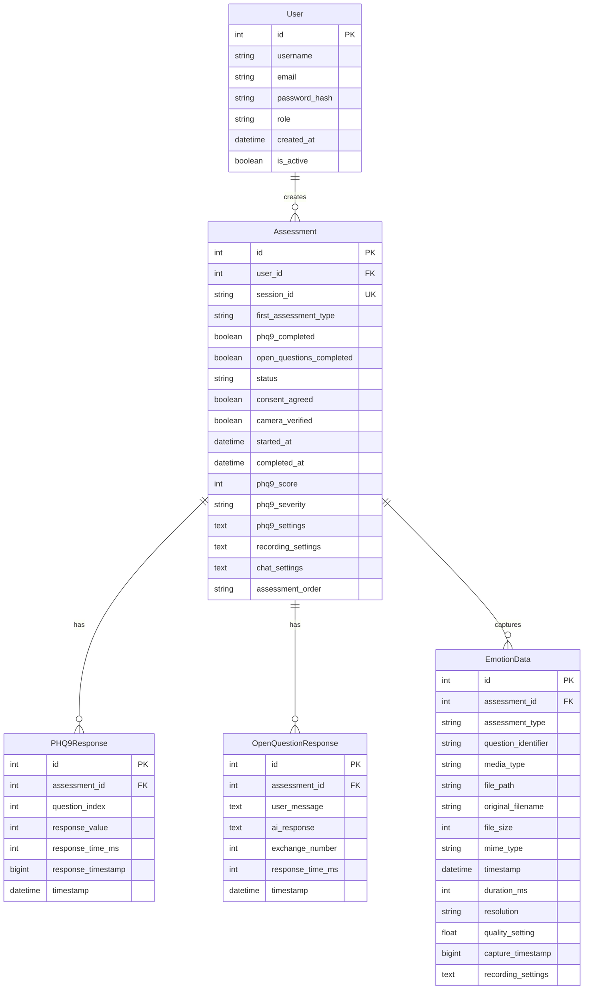
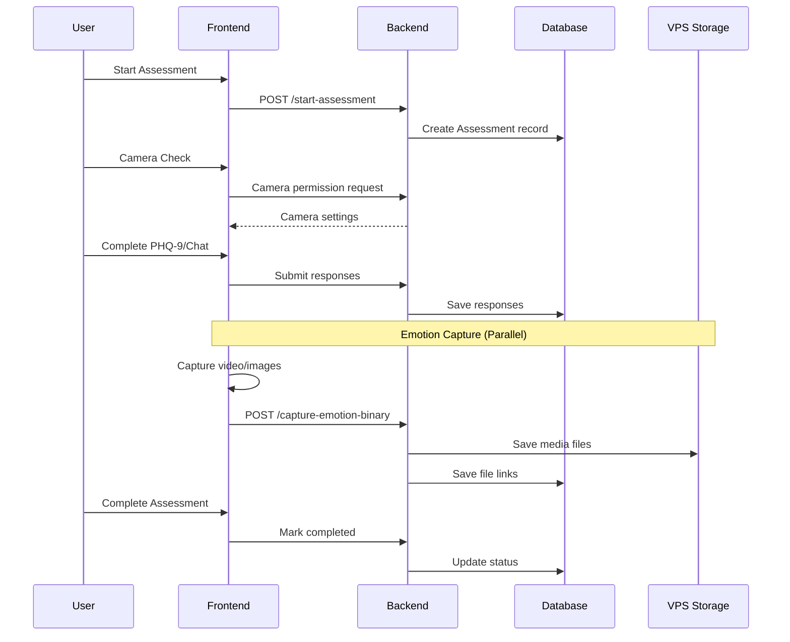
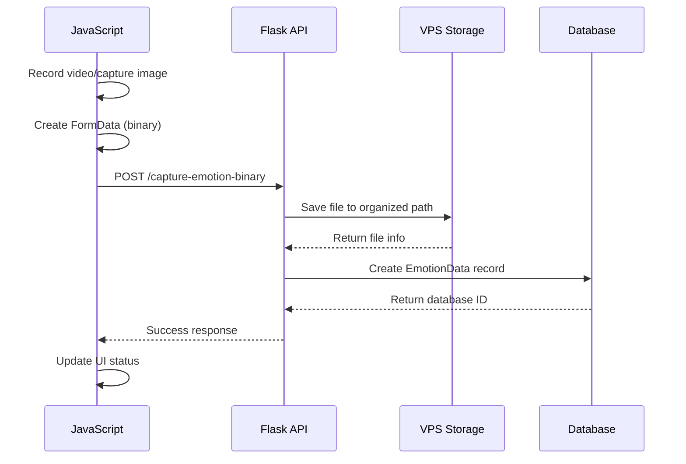
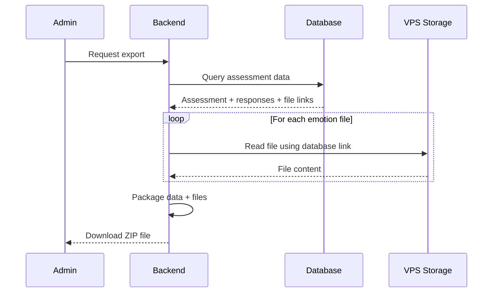
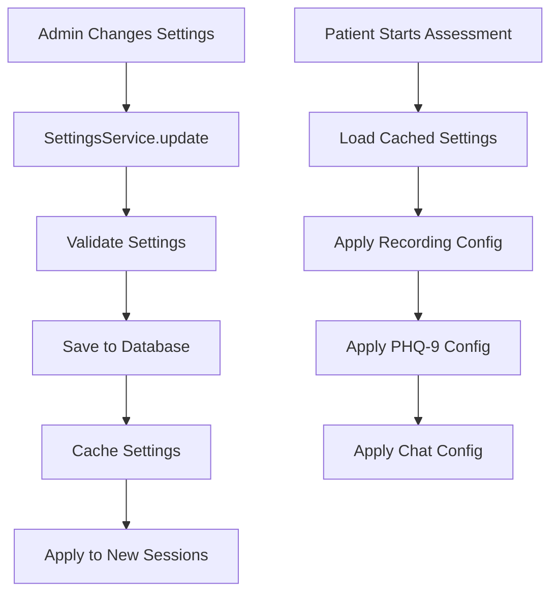

# Mental Health Assessment Application - Architecture Documentation

## 📋 Table of Contents
1. [Overview](#overview)
2. [Database Schema & ERD](#database-schema--erd)
3. [Routes Architecture](#routes-architecture)
4. [Services Layer](#services-layer)
5. [File Storage System](#file-storage-system)
6. [Data Flow](#data-flow)

---

## 🎯 Overview

This Flask application provides mental health assessments with emotion capture capabilities. The system combines PHQ-9 questionnaires, open-ended chat sessions, and real-time video/image emotion capture for comprehensive mental health evaluation.

### Key Features
- **Dual Assessment System**: PHQ-9 standardized questionnaire + AI-powered open questions
- **Emotion Capture**: Real-time video/image recording during assessments
- **VPS-Optimized Storage**: Efficient file management with database links
- **Export Capabilities**: Complete assessment data export for analysis
- **Admin Dashboard**: Settings management and data oversight

---

## 🗄️ Database Schema & ERD

### Entity Relationship Diagram



### Table Descriptions

#### **User Table**
- **Purpose**: Authentication and role management
- **Key Fields**: 
  - `role`: 'patient' or 'admin'
  - `is_active`: Account status control

#### **Assessment Table** 
- **Purpose**: Central hub for assessment sessions
- **Key Fields**:
  - `session_id`: Unique identifier for each assessment
  - `status`: 'in_progress', 'completed', 'abandoned'
  - `assessment_order`: Tracks which assessment was done first
  - JSON fields store configuration used during assessment

#### **PHQ9Response Table**
- **Purpose**: Stores standardized PHQ-9 questionnaire responses
- **Key Fields**:
  - `question_index`: PHQ-9 question number (0-8)
  - `response_value`: Scale response (0-3)
  - `response_time_ms`: Time taken to answer

#### **OpenQuestionResponse Table**
- **Purpose**: Stores AI chat conversation data
- **Key Fields**:
  - `exchange_number`: Conversation turn number
  - `user_message` & `ai_response`: Conversation content

#### **EmotionData Table**
- **Purpose**: Links to captured video/image files
- **Key Fields**:
  - `file_path`: Relative path to VPS storage file
  - `media_type`: 'video' or 'image'
  - `assessment_type`: 'phq9' or 'open_questions'

---

## 🛣️ Routes Architecture

### Route Structure

```
/
├── auth/                    # Authentication routes
│   ├── /login              # User login
│   ├── /register           # User registration  
│   ├── /logout             # User logout
│   └── /check-auth         # Session validation
│
├── patient/                # Patient-facing routes
│   ├── /dashboard          # Patient dashboard
│   ├── /start-assessment   # Begin new assessment
│   ├── /camera-check       # Camera permission/test
│   ├── /consent           # Informed consent
│   │
│   ├── PHQ-9 Routes
│   ├── /phq9-question/<int> # Individual PHQ-9 questions
│   ├── /phq9-submit        # Submit PHQ-9 responses
│   ├── /complete-phq9      # PHQ-9 completion
│   │
│   ├── Open Questions Routes  
│   ├── /open-questions     # Chat interface
│   ├── /chat-stream/<message> # SSE chat streaming
│   ├── /save-conversation  # Save chat session
│   ├── /complete-open-questions # Chat completion
│   │
│   ├── Emotion Capture Routes
│   ├── /capture-emotion-binary # VPS file upload (ACTIVE)
│   ├── /storage-stats      # Storage usage info
│   ├── /my-files          # User's captured files
│   ├── /session-files     # Current session files
│   ├── /validate-files    # File integrity check
│   │
│   └── /assessment-complete # Final completion page
│
└── admin/                  # Admin-only routes
    ├── /dashboard          # Admin overview
    ├── /settings           # Application settings
    ├── /assessment-data/<session> # View assessment data
    ├── /export-session/<session> # Export single session
    ├── /bulk-export        # Export multiple sessions
    ├── /storage-management # VPS storage stats
    └── /cleanup-storage    # Manual file cleanup
```

### Route Security

```python
# Decorator-based access control
@login_required           # Must be logged in
@patient_required        # Must have 'patient' role  
@admin_required         # Must have 'admin' role
```

### API Response Format

```python
# Standard JSON response format
{
    "success": true|false,
    "message": "Human readable message",
    "data": { ... },        # Optional data payload
    "error": "Error details" # Only on failure
}
```

---

## 🔧 Services Layer

### Service Organization

```
services/
├── assessment.py          # Assessment logic & flow control
├── assessment_balance.py  # Randomization of assessment order  
├── phq.py                # PHQ-9 questionnaire logic
├── openai_chat.py        # AI chat integration
├── vps_storage.py        # VPS file storage (ACTIVE)
├── media_file.py         # Legacy file handling (DEPRECATED)
├── admin.py              # Admin dashboard data
├── export.py             # Data export functionality
└── settings.py           # Configuration management
```

### Key Service Functions

#### **VPSStorageService** (Primary)
```python
class VPSStorageService:
    def save_video(user_id, session_id, assessment_type, video_data, filename, metadata)
    def save_image(user_id, session_id, assessment_type, image_data, filename, metadata)  
    def cleanup_old_files() # Automatic file retention
    def get_storage_stats() # Usage monitoring
    def get_user_files(user_id, session_id) # File retrieval
```

#### **AssessmentService** 
```python
class AssessmentService:
    def create_assessment_session(user_id) # Initialize new assessment
    def get_assessment_progress(session_id) # Track completion status
    def complete_assessment(session_id) # Finalize assessment
```

---

## 📁 File Storage System

### VPS Storage Architecture

```
./uploads/                          # Base storage directory
├── 2025/01/02/                    # Date-based organization
│   ├── user_123/                  # User isolation
│   │   ├── phq9/                  # Assessment type separation
│   │   │   └── session_456/       # Session-specific folder
│   │   │       ├── video_20250102_143022.webm
│   │   │       ├── video_metadata.json
│   │   │       └── images/
│   │   │           ├── capture_001.jpg
│   │   │           └── capture_metadata.json
│   │   └── open_questions/
│   │       └── session_789/
│   └── user_124/
└── 2025/01/03/
```

### Storage Features

- **Organized Structure**: Date/User/Assessment/Session hierarchy
- **Auto-Compression**: JPEG optimization for images  
- **File Size Limits**: 50MB max per file
- **Retention Policy**: 30-day automatic cleanup
- **Storage Monitoring**: 10GB total limit with usage tracking

### Database-File Linking

```python
# Database stores relative paths to VPS files
emotion_data.file_path = "2025/01/02/user_123/phq9/session_456/video.webm"

# Full path construction
full_path = f"./uploads/{emotion_data.file_path}"

# Export process uses database links to locate files
for emotion in assessment.emotion_data:
    export_file(f"./uploads/{emotion.file_path}")
```

---

## 🔄 Data Flow

### Assessment Flow



### Emotion Capture Flow



### Export Flow



### Settings Management Flow



---

## 🔧 Technical Implementation Notes

### Database Relationships
- **Cascade Deletes**: Deleting Assessment removes all related responses and emotion data
- **Foreign Key Constraints**: Ensure data integrity across relationships
- **Indexing**: Session IDs and user IDs indexed for performance

### File Management
- **Binary Upload**: FormData instead of base64 for 33% bandwidth savings
- **Progress Tracking**: XMLHttpRequest for upload progress on VPS
- **Error Handling**: Graceful degradation if file save fails

### Security Considerations
- **Role-Based Access**: Admin vs Patient route protection
- **Session Validation**: Assessment session ownership verification  
- **File Size Limits**: Prevent storage abuse
- **Path Validation**: Prevent directory traversal attacks

### Performance Optimizations
- **Lazy Loading**: Relationships loaded on demand
- **File Compression**: Automatic image optimization
- **Chunked Processing**: Large file handling for VPS deployment
- **Caching**: Settings cached to reduce database queries

---

## 📊 API Endpoints Summary

### Authentication
- `POST /auth/login` - User authentication
- `POST /auth/register` - User registration  
- `GET /auth/logout` - Session termination

### Patient Assessment
- `GET /patient/dashboard` - Patient overview
- `POST /patient/start-assessment` - Initialize assessment
- `GET /patient/phq9-question/<int>` - PHQ-9 question pages
- `POST /patient/phq9-submit` - Submit PHQ-9 responses
- `GET /patient/open-questions` - Chat interface  
- `GET /patient/chat-stream/<message>` - SSE chat responses

### Emotion Capture (VPS Optimized)
- `POST /patient/capture-emotion-binary` - Binary file upload
- `GET /patient/storage-stats` - Storage usage
- `GET /patient/my-files` - User file listing
- `GET /patient/session-files` - Session file listing

### Admin Management  
- `GET /admin/dashboard` - Admin overview
- `GET /admin/settings` - Settings management
- `GET /admin/assessment-data/<session>` - View session data
- `GET /admin/export-session/<session>` - Export single session
- `POST /admin/bulk-export` - Export multiple sessions
- `POST /admin/cleanup-storage` - Manual file cleanup

---

*This architecture supports scalable mental health assessment with comprehensive emotion capture and efficient VPS deployment.*